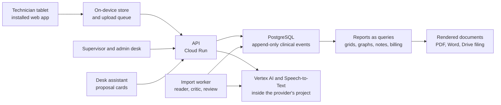

# Clinical Data Capture

**Paper-free ABA therapy data collection for a behavioral-health provider in Virginia: an offline-first technician tablet, a supervisor and office desk, and one append-only clinical record that every report is rebuilt from.**

---

## What it is

Applied Behavior Analysis (ABA) therapy runs on data. A technician working with a child scores every teaching trial, counts behaviors and writes a session note. A supervising clinician (a BCBA) reviews the graphs each week and decides when a skill is mastered and what to teach next. This system replaces the paper version of that loop.

Technicians capture data on shared tablets, including in homes and daycares with no network. Supervisors and office staff work from a desk application in the browser. Everything lands in one PostgreSQL record inside the provider's own Google Cloud environment. Weekly grids, graphs, session notes, treatment plans and the billing workbook are all produced from that record, not typed again.

## Highlights

- **Offline capture that never drops data.** On the tablet, local storage is the source of truth, not a cache. Every tap is saved on the device first and uploaded through a retrying queue, so a replayed upload still makes only one row. Nothing expires because a network did not show up. A session note can only be signed once every event from that session has reached the server, which the tablet checks on its own and the database checks again.
- **One event record, many reports.** Trials, behavior episodes and interval observations are stored as raw events. The weekly totals grid, progress graphs, session-note fields, mastery checks, billing export, payroll hours and audit coverage are all queries over that one record. Each of the practice's paper forms has a matching query that rebuilds it.
- **Clinical rules the database enforces.** Event tables are append-only: the application's database role cannot update or delete them, and triggers stop the owner too. A trial can't be written against a closed objective. A signed note can't be edited (corrections are addenda). A note narrative identical to another note is refused. A single verification script (about 1,400 lines) runs more than 100 checks against a live database, and 72 of them prove that an invalid write is *refused*, not just that reports look right.
- **Two views, not one screen with hidden buttons.** Technicians see goals and objectives read-only and score against them. Supervisors author objectives, set the prompt level and decide on mastery. Office admins manage staff, billing and records. The system flags mastery but never moves a child on by itself; a clinician decides, and declines are recorded too.
- **Treatment-plan authoring end to end.** Interactive VB-MAPP and ABLLS-R assessment workspaces feed six-month treatment plans with goal graphs. Plans autosave, keep every saved revision unchanged, and export to PDF and editable Word from the same saved version.
- **An AI desk assistant that proposes and never writes.** Supervisors can ask about a child's progress, or dictate a change. Every change comes back as a proposal card, and nothing touches the record until a person clicks Apply. Apply runs through the same routes and permissions as the desk itself. Signing, approvals, staff changes and similar acts have no tool at all. Model changes are gated on an evaluation harness where wrong-child and wrong-goal answers must be zero.
- **AI-assisted import of existing client records.** Each child's existing folder (plans, goal sheets, graph workbooks) is read by a model inside the provider's cloud, checked by a second "critic" pass against the source, and staged for clinician review with open questions, instead of being retyped by hand.

## The brief and the outcome

**What the provider needed.** A small ABA practice in Virginia ran its clinical data on paper. Technicians scored trials on paper grids. Supervisors retyped those into weekly totals grids, built graphs and wrote notes. The office built the billing spreadsheet by hand. The practice wanted to grow into home and daycare sessions, which paper made hard. The requirements were specific:

- keep all data inside the provider's own Google environment, with no subscription to an outside ABA platform;
- leave the billing service and staff scheduling alone, and only generate the spreadsheet the office already builds;
- shared tablets for the clinic, not a tablet per child, and no child photographs (initials only);
- work fully offline, and fit how the practice already teaches: supervisors write each short-term objective and its prompt level, technicians score against it, and mastery requires more than one instructor.

**What Emergent delivered.** A custom web app installed to the tablet home screen, a desk for supervisors and admins, and an API, deployed as one container to Cloud Run with Cloud SQL for PostgreSQL in the provider's own cloud project. The model of the clinic follows the practice's own paper method rather than a vendor's: the 10-trial graphing block that carries across days, the nine-step prompt hierarchy in the practice's order, the weekly review with its three dated outcomes, and note templates matching the practice's own forms. The work was shaped by regular feedback rounds with the practice owner, each answered with a dated package of fixes.

**What it changed.** The weekly grid is no longer a typing job, because it is a query. Session notes start pre-filled from the session's actual data, and the technician signs them on the tablet. Graphs are drawn from the record at the moment a document is made. Supervisors run their weekly review, change objectives, enter past paper sessions and approve treatment plans in one place, and the office downloads the billing workbook instead of building it. Existing paper-era records can be brought in with review rather than re-keyed.

## Architecture

The tablet and the desk are one React app served by a Fastify API in a single container. Signed-in staff see the surface their role allows. On the tablet every write is saved to the device and then sent to the API, carrying a unique key so a retry can't duplicate it. The API writes to PostgreSQL through a database role that can only add rows to clinical event tables.

Everything a clinician or the office reads is computed from those events: the weekly grid, graph points, mastery windows, note fields and billing rows. Documents render on the server. Filing a signed note to Google Drive happens after the signature and never holds it up, and treatment plans export to PDF and Word. AI features use Google's Vertex AI and Speech-to-Text inside the provider's cloud project, only on generally available models. The folder import runs as a scheduled background job that processes one step at a time.

The full walk-through is in [docs/architecture.md](docs/architecture.md).

## Privacy-minded by design

The system handles health records, so privacy was a design input from the first migration, not a later review. At a high level:

- **Data stays with the provider.** The app, database, files and AI calls all run inside the provider's own cloud project, under the provider's agreements with its cloud vendor. The work was done under a signed Business Associate Agreement.
- **Development never touches real records.** All design, development and testing use a synthetic data generator. The code repository holds code only, and the verification script fails if a document or export file ever appears in it.
- **Named people, clear roles.** Staff sign in with their own work accounts, invited by an admin. Unknown accounts are refused rather than enrolled automatically, and shared role mailboxes can never become a clinician login. Three roles, each with its own view.
- **Shared tablets handled carefully.** No account is signed in at the device level. An inactivity lock with a short PIN resumes the same person's session, and opening a different child needs a full sign-in, so one technician can't chart under another's name. The child is shown by initials only.
- **Every row is attributable.** Each clinical event records who captured it, the tablet's time and the server's receipt time. Corrections are new rows or signed addenda, never overwrites. An audit query checks that nothing is unattributed.
- **Minimum data in logs and AI.** Logs carry codes and counts, never what anyone said or wrote. Dictated audio is transcribed and discarded. Import diagnostics use a closed vocabulary of codes and counts, so a trace can't carry document text, file names or model output.

## Engineering notes

**Objectives are versions, so offline conflicts disappear.** A supervisor never edits a short-term objective on paper; she ends it with a date and writes the next one beneath. The schema does the same: objectives are immutable, each new one points to the one it replaces, and every trial is tied to the exact version it was scored against. If a tablet has been offline all morning under version 3 while the supervisor publishes version 4, there is no conflict to resolve. Those trials belong to version 3 and always did. The prompt level is copied onto each trial from its objective when it is written, so a `+` recorded today can still be read correctly decades later, which matters because a minor's records are kept for about 21 years.

**One sound for both keys.** The tablet's `+` and `−` keys are large (88-point minimum) and flash in their own colour, because the technician is looking at the child, not the screen. They make the same click. Two different tones would tell the child whether they got it right, which is feedback the supervisor's plan did not prescribe. The sound is synthesized with Web Audio, so there's no file to load and it works on iPadOS, where vibration does not.

**Two clocks, and disagreements are flagged.** The tablet's clock is the clinical and billable time, because it was the only clock in the room. The server's receipt time is stored beside it for audit. When the two disagree implausibly the row is flagged, never quietly corrected. The case it catches in practice is a tablet set to the wrong timezone, which network time sync doesn't fix and which would file billable time on the wrong day.

**Graph blocks and mastery windows are different things.** A graph point is a block of 10 trials, and a block can span days: two trials Monday and eight Tuesday make one point. Mastery is a percentage across 2, 3 or 5 consecutive sessions (or a number of weeks), with a minimum number of trials so a two-trial day can't score 100%. Mastery also counts distinct instructors. Keeping those apart in the schema is what lets the graphs match the practice's paper exactly while mastery is evaluated correctly.

**A hard-coded colour fails the build.** The app ships six palettes, each with a day and a night mode, so twelve combinations. A literal colour anywhere in the front end would break exactly one of them, and nobody would notice until a technician on that theme reported it. A lint rule turns any hard-coded colour into a build failure, and the verification script checks that the rule actually refuses. Printed documents ignore all of it and always render as ink on white.

## Tech stack

| Layer | Technology |
|---|---|
| Tablet and desk | React 19, TypeScript, Vite; installable web app with a service worker and IndexedDB (`idb`) |
| API | Node.js 22, Fastify 5, TypeScript; OpenID Connect sign-in (`openid-client`, `jose`) |
| Database | PostgreSQL 16 on Cloud SQL; 66 numbered SQL migrations, PL/pgSQL triggers for append-only and signature rules |
| Documents | `pdf-lib` for PDF, `docx` for Word, `sharp` for graph images, ExcelJS for workbooks |
| AI | Gemini on Vertex AI (tool calling for the desk assistant, document reading for imports), Cloud Speech-to-Text for dictation |
| Hosting | One container on Cloud Run; a Cloud Run Job on a scheduler for imports; Google Drive for filed documents |
| Data and tests | Python synthetic data generator, SQL query harness, Node test runner, a database verification script |

## By the numbers

| | |
|---|---|
| Commits | 140 (2026-09-07 to 2026-10-05) |
| Source lines | 125,667 |
| Tracked files | 709 |
| Test files | 231 |
| SQL migrations | 66 |
| Database verification | 119 scripted assertions plus API and lint checks; 72 prove an invalid write is refused |
| Languages | TypeScript 83.5%, PL/pgSQL 6%, JavaScript 2.9%, Python 2.7%, CSS 2.3%, Shell 2.1% |

## About this repo

The source code for this project is private and belongs to the client's engagement. This repository documents what was built and how it works. It contains no source code, no client data and no information that identifies the provider, its staff or the children it serves.

Built by [Emergent AI Agency](https://emergentaiagency.com) (Ryan Chappell). Emergent builds custom software for practices that have outgrown paper and don't want to rent a platform that doesn't fit how they work. To talk about a project, get in touch through [emergentaiagency.com](https://emergentaiagency.com).
