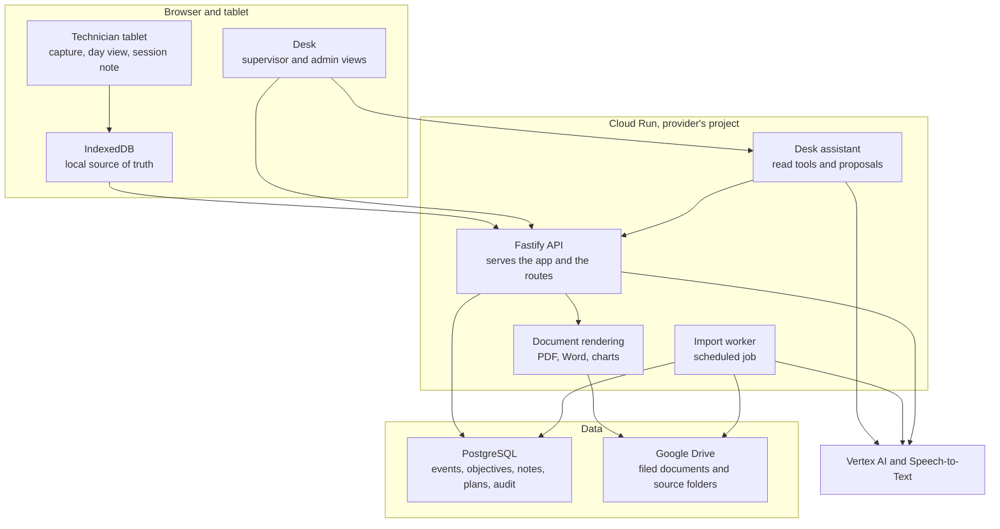
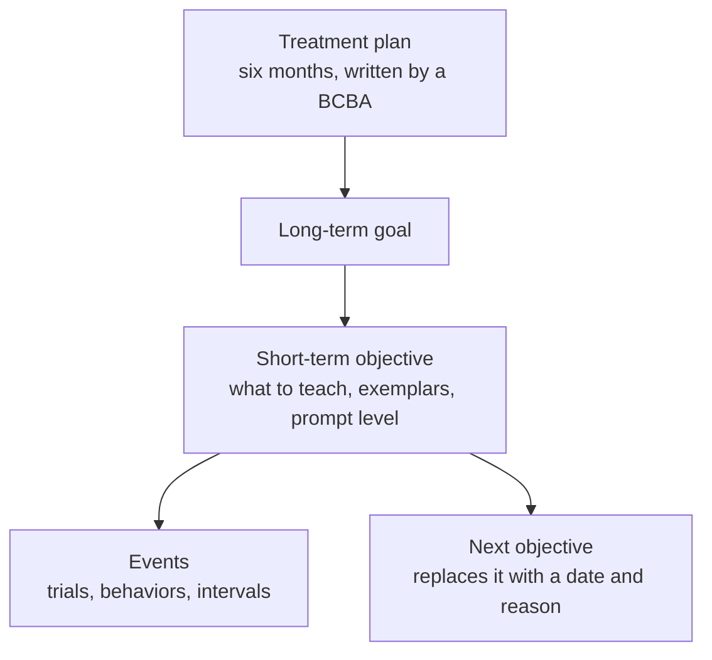
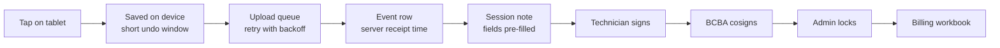
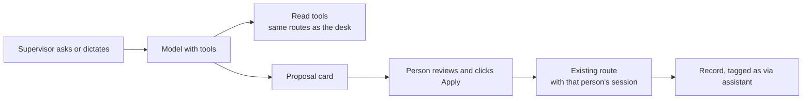
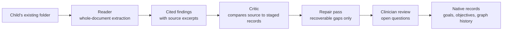

# Clinical Data Capture: architecture

This document goes one level deeper than the [README](../README.md): how the clinical record is modelled, how data moves from a tablet to a signed note and a billing file, where AI is used and where it is deliberately kept out, and how the system is tested. Snippets are illustrative shapes rewritten for this page, not product code.

## Design principle: model events, not documents

The practice's paper system was a stack of forms: a trial grid, a weekly totals grid, graphs, a session note, a billing spreadsheet, a payroll sheet. The obvious build would be one screen and one table per form. This system does the opposite. It stores what *happened*: a trial was scored, a behavior occurred, an interval was observed. Every form becomes a query over that one event stream.

The test of the model is simple and is written down as code: each of the practice's paper artifacts has a query in a harness that rebuilds it from the events. If a form can't be rebuilt, the model is wrong, not the form.

Two consequences follow:

- **Raw measurements are stored and scores are derived on read.** If a mastery threshold changes, history is re-scored rather than invalidated.
- **Nothing clinical is ever overwritten.** Corrections are new rows; changes to signed documents are addenda.

## 1. Components



| Component | Responsibility |
|---|---|
| Tablet app | Portrait-first capture for one child at a time: `+` / `−` trial keys, a behavior strip, interval and task-analysis capture, a "what hasn't this child had today" day view, and the session note. Installed to the home screen. |
| Desk | The same React app at a different surface. Supervisors: caseload, graphs, weekly review, objective editor, goal setup and activation, past-session entry from paper, note review and cosign, treatment plans, assessments. Admins: staff invites and roles, note locking, billing workbook, internal hours tracking, client records. |
| API | One Fastify service. Owns sign-in, role checks on every route, writes, queries and document rendering. Serves the built front end as static files, so the whole product is one container. |
| PostgreSQL | The clinical record. 66 numbered migrations, each re-runnable from empty, enforce the rules that must hold no matter what the application does. |
| Import worker | A Cloud Run Job started on a schedule. It claims one durable step at a time from the database, so overlapping runs can't process the same work. |
| AI services | Gemini on Vertex AI and Cloud Speech-to-Text, called inside the provider's cloud project, on generally available models only. |

## 2. The clinical model

### The teaching chain



The short-term objective is the unit of instruction. The supervisor writes it, together with its exemplars and a prompt level chosen from the full nine-step hierarchy in the practice's order. The technician reads it and scores against it.

**Objectives are immutable and chained.** Ending an objective records a date and a reason (mastered, discontinued or revised), and its successor points back to it. An objective's ID *is* its version. Every trial binds to the version it was captured against, and the prompt level is copied onto the trial by a database trigger at write time, whatever the client sent. This is why an offline tablet and a supervisor editing the same goal never conflict, and why a graph point can never mix two prescribed prompt levels.

### Three event shapes

| Shape | One row per | Holds |
|---|---|---|
| Opportunity | trial or opportunity | discrete trials, natural-environment opportunities, task-analysis steps, probes |
| Behavior episode | occurrence | behavior counts, rate-per-hour programs, durations |
| Interval observation | time bucket | the practice's interval behavior grid |

A goal's measurement type chooses the capture widget, the metric formula and the chart type. Nothing else branches on which program it is.

### Blocks, windows and mastery

- **The graph point is a 10-trial block, and it crosses days.** Nothing is graphed until a block is complete; a short block shows as a fraction "in progress", the practice's own notation. A block can't span two objective versions.
- **Mastery is a window**: a target over 2, 3 or 5 consecutive sessions, or 2 or 4 weeks, with a comparison (at least, at most, equal to) and a minimum number of trials per session where the metric is a percentage. Reduction goals for behaviors use the same machinery in the other direction.
- **Generalization is part of the criterion.** Mastery counts distinct instructors and settings, so reliable staff identity on every row is a clinical input, not only a compliance one.
- **The system flags; a clinician decides.** It never advances a child automatically. The supervisor's decision, including a decision to wait, is recorded.

### Rules the database enforces

```sql
-- illustrative: the shape of the append-only guarantee
revoke update, delete on opportunity_event from app_role;

create trigger refuse_mutation
  before update or delete on opportunity_event
  for each row execute function raise_append_only();
```

Enforced in PostgreSQL, not only in the API:

- Event tables are append-only for the application role, and a trigger stops even the table owner.
- A trial can't be written against an objective that closed before the trial's date, or added to a closed block.
- A replayed upload key produces one row, not two.
- A "delivered prompt" annotation is allowed only on an incorrect trial and only for a *more* intrusive prompt than prescribed, so it can't become a back door for claiming independence.
- A note is never created already cosigned, a signed note can't be edited, and a narrative that is byte-identical to another note is refused, because payers reject copied progress notes.
- A note can't be signed while events from that session are still waiting on a device.

## 3. From a tap to the billing file



**On the device.** A tap is written to IndexedDB first and is complete at that moment; nothing in the interface waits for the network. Each tap is held briefly so the technician can undo or correct it, because once a row reaches an append-only table it can only be corrected by another row. The queue is sized for a full day offline (on the order of a thousand rows per device). It flushes on events the page reliably gets (coming online, becoming visible, app launch and a slow timer), since iPad Safari has no background sync. Rows the server acknowledges are removed; rows it refuses are kept, shown and no longer retried. Nothing is dropped for being old.

**Idempotency.** Each event carries a key generated on the device. The same key is the primary key locally and the uniqueness rule on the server, so a retry after a dropped connection is harmless.

**Two clocks.** The tablet's time is the clinical and billable time. The server records its own receipt time beside it, and implausible gaps are flagged for review rather than silently fixed.

**The note.** Structured facts fill themselves in from the session: date, times, setting, technician and credentials, and the methods and programs actually run. The technician confirms rather than ticks, and can dictate the narrative using speech-to-text. Each note type follows the practice's own template. After signing, the note moves through BCBA cosign (where the note type needs one) and admin lock. Unlock and relock are recorded with a reason. Only locked notes reach the billing workbook.

**Office outputs.** The billing workbook is an Excel file in the shape the office already used, with weekly totals, payroll and a graph sheet. A separate internal-tracking view counts every hour, including hours with no client or no note, which payroll needs.

## 4. Treatment plans and assessments

Supervisors author six-month treatment plans in the desk:

- **Assessments.** Interactive VB-MAPP Milestones, VB-MAPP Barriers and ABLLS-R workspaces. Zero, "not tested" and blank are different states. Revisions are append-only, concurrent edits are detected and shown rather than silently overwritten, and a plan inserts a frozen snapshot of selected dates and domains.
- **Goals.** Goals carry forward from a previous plan with their numbers, can be pasted in and confirmed one per row, and come with graphs generated from the record when the plan is saved.
- **Saving.** The plan autosaves drafts and keeps unsaved edits through a screen lock or an expired sign-in. Each saved revision stores the plan and its rendered PDF together, so preview and download always show the same bytes. Word export renders the same saved revision as editable paragraphs and tables.
- **After approval.** Adding or stopping a goal mid-period is a dated addendum to the plan in force. Goals then go through a setup checklist (collection basics, mastery settings, review statements) before they activate on the tablet.

Documents use one fixed print design, ink on white, regardless of the app's theme. A clinical document is evidence and has to look the same when it is printed years from now.

## 5. Where AI is used, and where it is kept out

All AI calls go to Google's Vertex AI and Speech-to-Text inside the provider's own cloud project. Only generally available models are used, web search and grounding tools are never enabled, and no model is chosen by a default in code; if a model isn't configured, the feature reports itself unavailable and the rest of the app works as normal.

### The desk assistant



- **Reads** run immediately through the same routes the desk uses: find a child, summarize progress, show a goal's graph, list notes awaiting review, check authorization use.
- **Changes are proposals.** Activating goals, mastery settings, a changed objective, a past session entered from paper: each arrives as a card. Applying it replays the change through the normal route under the person's own session and permissions, tagged so the record shows the assistant was involved. A card applied after the underlying data changed is marked stale.
- **Words must be the user's.** Objective wording, numbers and dates on a card must come from what the person actually said; otherwise the assistant asks. Review statements always start unticked.
- **Some acts have no tool at all.** Signing, cosigning, locking, plan approval, staff changes, archiving a child and voiding a record are not registered, and a test checks every tool name against that list. For these the assistant explains where the button is.
- **Evaluated before every model change.** A harness runs scripted conversations over a synthetic caseload. Wrong-child and wrong-goal results must be zero. The continuous-integration version runs against a deterministic stand-in for the model.
- **Data handling.** Dictated audio is transcribed and discarded. Conversations and applied proposals are kept, append-only, because they explain changes to the record. Logs carry codes and counts only.

### Importing existing records

Bringing a child's existing paper-era folder into the system is the other AI-heavy path:



- A model reads each document whole and returns findings that cite excerpts. Code accepts a finding only if its excerpt really occurs in the retained source.
- A second "critic" pass compares the original documents with the staged records and reports mismatch codes: a goal in the source that is missing natively, wording that isn't in the source, a requested service treated as approved. A repair pass re-reads only for the recoverable codes; everything else becomes a proposal or a report for a person.
- Graph workbooks are parsed in code, including several charting layouts. A percentage is stored only when its basis is explicit, never inferred.
- Every run leaves a per-file trace drawn from a closed vocabulary of stage codes and integer counts. The trace is rejected outright if it contains anything outside that vocabulary, so a failed run can be diagnosed without anyone seeing document content. A read-only reconciliation report checks the persisted import evidence for duplicates and gaps.

## 6. Identity, roles and the shared tablet

- **Three roles**: technician, BCBA and admin. Each has its own surface; a higher role may switch down, and a technician who follows an old desk link is sent back to the tablet. Every route enforces its own role check.
- **Named accounts only.** Staff sign in with their own work accounts. An admin invites a person, and the first sign-in binds the invite to that account's stable identifier, so a renamed email doesn't fork someone's clinical history. There is no automatic enrolment, and shared role mailboxes are refused.
- **Shared tablets.** Tablets are a pool sized by concurrent sessions, not owned by a child. No account is signed in at the device level. After inactivity the app locks, and a short PIN resumes the same person's session on that device (the PIN resumes a session; it is not a sign-in). Switching to another child needs a full sign-in. The child's initials stay visible in the header.
- **Development sign-in can't reach production.** A local sign-in mode exists for development with synthetic staff; a production build refuses to start if it is configured.

## 7. Building and testing without real data

- **Synthetic data only.** A Python generator with no dependencies produces a full synthetic caseload with sessions, events and staff, plus focused scenarios for chained objectives, concurrent observers, intervals and offline overflow. It is the required way to develop and test, not scaffolding.
- **Same privilege as production.** Development connects through the same restricted database role as production, so append-only rules bite in development too, not only after deployment.
- **Database verification.** One script resets a database, loads synthetic data and runs 119 scripted assertions plus API and lint checks: every harness query returns rows, structural rules hold (no block spans two objective versions, every trial's prompt level matches its objective), and 72 invalid writes are refused. It also fails if a document or export file appears in the repository, and checks that the theme lint rule actually rejects a hard-coded colour.
- **Test suites.** 231 test files (per the project's file-naming count), most of them in the API, covering routes against a real database, note templates, plan rendering, mastery evaluation, the import pipeline stage by stage, and the assistant's tool boundaries.
- **Theming discipline.** Six palettes with day and night modes are tokens extracted from an approved design page. Nothing in the UI names a colour, and a lint rule blocks the build if anything does.

## 8. Decisions worth noting

| Decision | Why |
|---|---|
| Build inside the provider's own cloud, not on a third-party ABA platform | The provider keeps its data and its existing Workspace; no per-seat platform subscription; the system follows the practice's method instead of a vendor's. |
| PostgreSQL on Cloud SQL, reached privately | Strong constraints and triggers for clinical rules; no public database surface. |
| One container for app and API | One deploy path and one place charts are drawn; the same image runs in development and production. |
| Installable web app, not a native app | Updates ship with a deploy; designed for iPad Safari's actual limits (no orientation lock, no background sync, no vibration). |
| Server-side document rendering | Long plans with many charts render reliably in one place and land complete or not at all. |
| Two views instead of permission-gated controls | Technicians and supervisors do different jobs; one screen with hidden buttons serves neither well. |
| AI proposes, people apply | Clinical approval and signatures stay human; every AI-assisted change goes through the same checks as a manual one and is labelled. |
